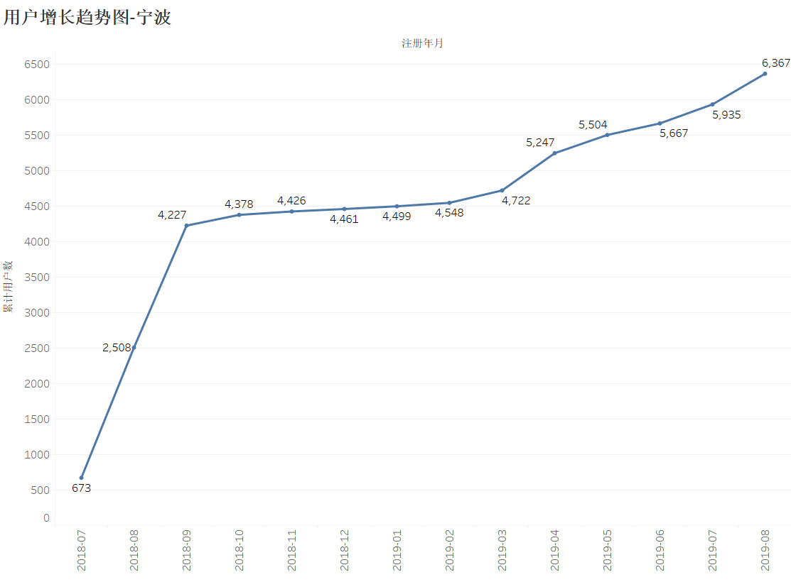
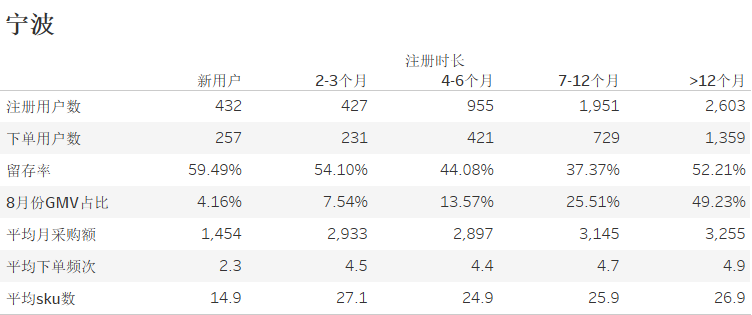

拼便宜系统上线两年多，已经积累了大量的用户，本次主要针对用户数据进行分析。

### 一、用户总览

数据选取自2019年8月份的用户交易相关数据。

下图展示了各个城市用户基数、下单人数、日均DAU等一些指标的对比。

从图中可以看出：

1、武汉的用户基数最多，杭州次之。但是杭州下单人数、日均DAU最高，说明杭州的整体用户留存情况最好。

2、杭州的月店均采购额，平均单店交易sku数、平均下单频次、客单价均最高，说明杭州经过两年多的运营，已经发展的比较成熟稳定了。

[^注]: 有效用户数：目前店铺状态是正常的店铺，不包括停业和黑名单的店铺。

### 二、用户增长趋势

下图展示了四个城市的用户增长趋势图，数据选自每个城市从开城到2019年8月份每个月的累计注册用户数。

从图中可以看出：杭州、武汉和宁波在2019年4月开始用户增长率都有明显提升。

1、杭州：用户增长最快的时期是2018-05至2018-09，后面缓慢增长，2019-07、2019-08由于冲锋月的缘故，又挖掘了一批新用户。

2、武汉：开城后的半年用户增长缓慢，在2018-06至2018-09这四个月增长最快，用户数增长了7500人左右；在2018-10至2019-03用户增长基本趋于平稳，在2019-04之后，用户又有所增长。

3、宁波：用户增长最快的时期是2018-08至2018-09这两个月，在2018-10至2019-03这段时间用户增长很缓慢，半年时间仅仅增长了500人左右，2019-04之后，增长趋势变快。

4、苏州于2019年5月份开城，用户增长趋势很猛。在未来一段时间，应该会保持原有的增长趋势。

### 三、用户结构分布

如下是各个城市不同用户结构分布图，数据选自截止2019年08月底的所有有效注册用户数。

- ##### 用户分层

根据用户历史下单情况对用户进行分类，可以将用户分成高频、中频、低频、存活、休眠和未激活6个等级。从用户分层结构可以看出，武汉有45%的用户未激活，如果能将这些用户激活，将会带来很大的收益。其他城市各个分层的比例差不多。

- ##### VIP等级

- ##### 注册时长

根据注册时长对用户进行分类，可以将用户分成新用户、2-3个月、4-6个月、7-12个月、12个月以上5个等级。由于杭州开城最早，所以杭州注册时长12个月以上的用户最多，其次是武汉、宁波。苏州5月份刚开城，从图中可以看出，注册时长2-3个月的用户最多。

- ##### 店铺规模

根据店铺规模对用户进行分类，可以将用户分成小于300m、300-600m、600-1000m、大于1000m四个等级。可以看到300-600m规模的用户最多，约占35%-40%不等，小于300m规模的用户次之，约占26%左右。

[^注]: 蓝色图块为空值，表示改店铺规模没有维护。

### 四、各城市各类型用户指标对比

数据选取自2019年8月份的用户交易相关数据。

##### 1、不同店铺规模下的月店均采购额对比

除了苏州以外，其他城市不同店铺规模的月店均采购额基本上差不多，且店铺规模大的店铺，月店均采购额反而小。建议后期可以对店铺规模大的店铺投入更大的关注，或许可以带来不错的收益。

##### 2、不同注册时长下的指标对比

杭州、武汉和苏州统计数据显示，注册时长在6个月以上的老用户对于核心指标贡献更大，忠诚度最高，注册时长在7-12个月的用户留存率都较低，可出推出相应的激活手段。

1）杭州：新用户注册不多，留存率较高，8月份77%的GMV是由注册6个月以上的老用户贡献，新老用户对于核心指标的贡献差异明显，老用户的月均采购额、下单频次和采购SKU数都明显高于新用户；

2）武汉：新用户留存率最低，注册半年内用户下单占比高于杭州和宁波，各类注册时长用户的平均采购频次都略低于其他三城；

3）宁波：各类注册时长用户的留存率差异不大，老用户的月均采购额差异相对较小；

4）苏州：基本符合城市历史规律，注册时间越长的用户对于指标的贡献更大，各类型用户月均采购额、下单频次和平均SKU数都高于武汉和宁波，发展势头很好。

### 五、用户偏好

数据选取自2019年8月份的用户交易相关数据。

##### 一、各类型用户的活动商品GMV占比

- ##### 店铺规模

不同规模店铺对于活动商品的偏好基本一致，其中苏州的普通商品GMV占比最低在20%左右，武汉的组合商GMV占比最高，杭州的普通商品GMV占比最高，会员商品GMV占比高于组合商品。

1）杭州：不同规模店铺对于活动的偏好差异不大，但从下图可以看出，随着店铺规模增大会员商品GMV占比略有升高；

2）武汉：随着店铺规模增大组合商品的GMV占比下降；

3）宁波：各规模店铺对于活动的偏好差异不大，63%左右都是爆品，可能是因为宁波其他活动商品较少或无明显吸引力；

4）苏州：爆品GMV占比高达75%以上，各类用户对于不同活动类型偏好差异不明显，主要还是受城市自身运营的活动类型影响。

  - ##### 用户分层

1）杭州：中高频用户会员商品的GMV占比最高，随着用户下单频次的增加可享受更多会员优惠，故爆品GMV占比越小，各类型用户对于组合商品的偏好差异不大；

2）武汉：各分层用户的活动偏好稳定几乎无差异；

3）宁波：存活用户爆品GMV占比最低，高中低频用户对于爆品的依赖相对更强；

4）苏州：高频用户的普通商品GMV占比最低仅为17%，苏州用户对于活动商品的依赖很高。

##### 二、分层用户红包使用情况

数据选自8月份用户下单红包使用情况。

红包使用率 = 本月使用的红包 / 本月发放的红包， 由于赔付红包使用期限较长，存在本月使用历史发放的情况较多，故存在使用率大于100%的情况；系统发放红包包含很多红包种类，发放数量最大使用率偏低，使用该类红包的订单GMV占比最多，一般用户下单频次越高各类红包的使用率越高，费率越高。

1、杭州：随着用户下单频次增多，各类型红包的使用率都升高，拼福利红包使用率升高且红包费率升高，高频用户的拼福利红包费率高达2.11%，明显超出红包平均费率；

2、武汉：口令红包费率较高，但发放数量不多，其他红包类型的红包费率差异不大，拼福利红包的使用率很低，签到红包的使用率较其他城市略高，新人红包使用率在四城中最高；

3、宁波：高频用户的拼福利红包费率高达2.15%；

4、苏州：拼福利红包的使用高费率较其他城市偏低，各类红包的使用率和费率相对稳定。

### 六、用户留存率

数据选自2019年07月份的所有下单用户在2019年08月份的留存情况。

从下图可以看出：

1、留存率：高频>中频>低频>存活,说明下单频次多的用户，越不容易流失；

2、随着平均交易sku数的增大，留存率也越来越来大；

由此可以看出留存率跟用户下单频次和交易sku数有很大关系，下单频次多和交易sku数多的用户，对我们平台越忠诚，越不容易流失。

### 七、用户流失预测模型

定义：基于当月的下单用户，根据一些指标特征，去预测这些用户在未来30天内的流失（未下单）情况。

##### 1、特征重要性

根据用户流失预测模型，可以看出影响用户流失（或留存）最重要的特征是GMV、下单数、距今最近一次下单时长、活跃天数、交易sku数等。

##### 2、SHAP_value

SHAP_value最大的优势是能反映出特征的影响力，而且还表现出影响的正负性。

下图中每一行代表一个特征，横坐标为SHAP_value。SHAP_value>0,表示对流失有正向影响力，SHAP_value<0,表示对流失有负向影响力。一个点代表一个样本，颜色越红说明特征本身数值越大，颜色越蓝说明特征本身数值越小。

我们可以直观地看出GMV是一个很重要的特征，GMV越小，会给流失带来正向影响力。距今最近一次下单时长也会影响流失，红色点主要集中在SHAP_value大于0的区域，可见距今最近一次下单时长越长越容易流失。

以下绘制了特征值对流失的影响程度。横坐标是特征值，纵坐标是shap_value值，值越大，影响力越大。

1、当GMV<2000时，shap_value>0,说明当GMV<2000时，对流失有着正向的影响力。

2、当下单数<=2时，shap_value>0,说明当下单数<=2时，对流失有着正向的影响力。

3、当距今最近一次下单时长>5时，shap_value>0,说明当距今最近一次下单时长>5时，对流失有着正向的影响力。

4、当活跃天数<=5时，shap_value>0,说明当活跃天数<=5时，对流失有着正向的影响力。

5、当交易sku数<=15时，shap_value>0,说明当交易sku数<=15时，对流失有着正向的影响力。

